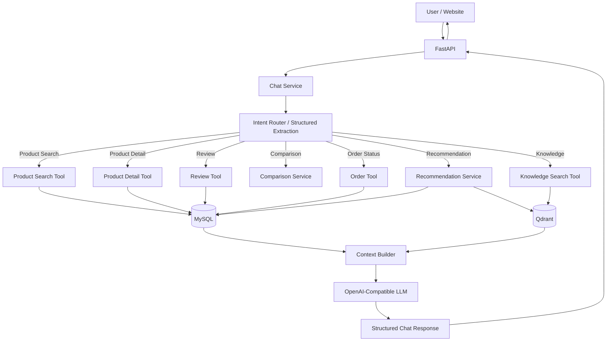
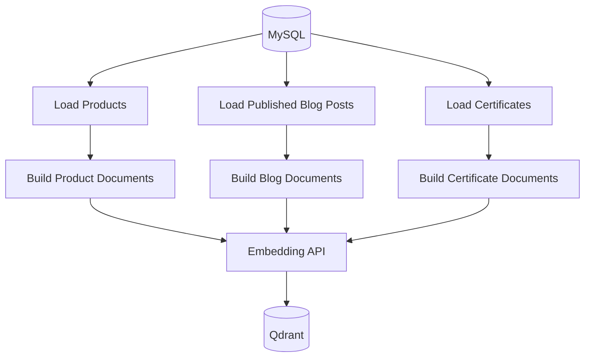
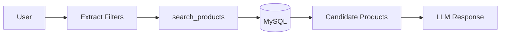
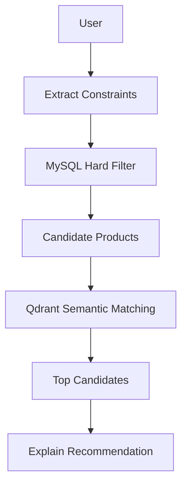
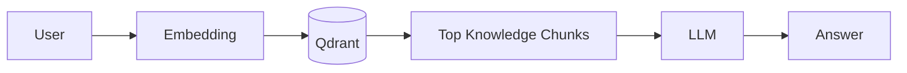
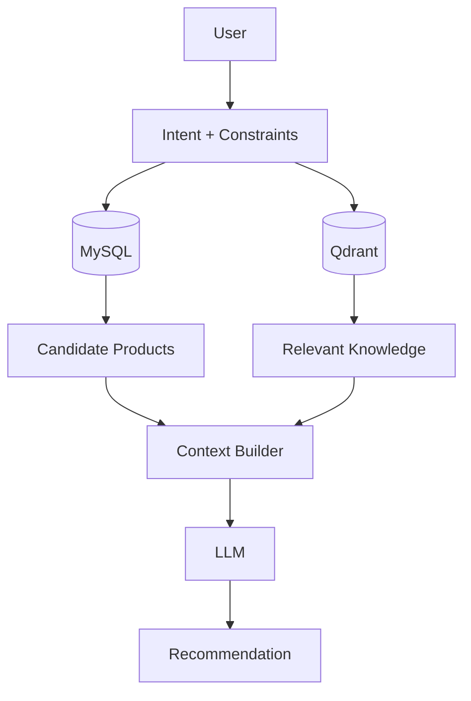
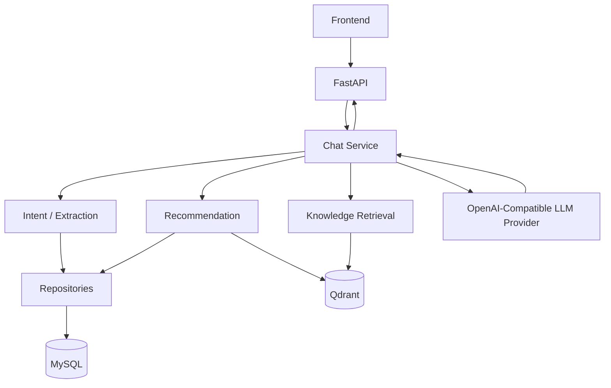

# LIFEGIFT AGRICULTURAL PRODUCT CHATBOT
## Detailed Implementation Plan — MySQL + Qdrant + LangChain + OpenAI-Compatible LLM

**Project type:** AI product recommendation chatbot for Vietnamese agricultural products  
**Backend:** FastAPI  
**Primary database:** MySQL  
**Vector database:** Qdrant  
**LLM orchestration:** LangChain  
**LLM provider:** Any OpenAI-compatible endpoint  
**Architecture principle:** Simple, explicit, testable, no unnecessary production complexity

---

# 1. PROJECT GOAL

Build a chatbot for an agricultural e-commerce website similar in product scope to LifeGift.

The chatbot should help users:

1. Search for products using natural language.
2. Filter products by price, category, origin, brand, availability.
3. Recommend products based on preferences.
4. Compare products.
5. Answer product and agricultural knowledge questions.
6. Show accurate current price and stock.
7. Read verified customer reviews.
8. Check order status for authenticated users.
9. Provide product cards to the frontend alongside natural-language answers.

The system must avoid hallucinating product information.

The main rule is:

```text
MySQL  = source of truth for structured / frequently changing data
Qdrant = semantic retrieval for descriptive / knowledge data
LLM    = intent understanding + tool selection + answer generation
```

---

# 2. NON-GOALS

The MVP intentionally does **not** include:

- Multi-agent architecture
- LangGraph
- Neo4j
- Elasticsearch
- Kafka / RabbitMQ
- Redis unless a real caching need appears later
- Celery
- Microservices
- Autonomous Text-to-SQL
- Agent-generated arbitrary SQL
- Complex workflow engines
- Separate reranking service
- Fine-tuning
- Event sourcing
- CQRS
- Kubernetes
- Multiple vector databases
- Separate vector collection for every document type

These may be considered later only when a concrete requirement justifies them.

---

# 3. HIGH-LEVEL ARCHITECTURE



---

# 4. RESPONSIBILITY OF EACH COMPONENT

## 4.1 MySQL

MySQL remains the authoritative source for:

- Product identity
- Category
- Brand
- Current price
- Sale price
- Inventory
- Availability
- Orders
- Payments
- Coupons
- Reviews
- Product certificates metadata
- Chat history

Do not rely on Qdrant for current price, inventory, order status, coupon state, or payment state.

---

## 4.2 Qdrant

Qdrant is used for semantic retrieval of:

- Product descriptions
- Product stories
- Taste profiles
- Suitable-for descriptions
- Usage instructions
- Storage instructions
- Blog content
- Agricultural knowledge
- Certificate descriptions
- Product-related explanatory content

Qdrant is **not** the authoritative source for changing transactional data.

---

## 4.3 LangChain

LangChain is used only where useful:

- LLM initialization
- Structured output
- Tool definitions
- Prompt composition
- Retriever integration
- Message formatting

Do not force all application logic into LangChain.

Routing can remain normal Python code.

---

## 4.4 LLM

The LLM is responsible for:

- Intent classification
- Constraint extraction
- Understanding soft preferences
- Choosing among explicitly defined tools
- Comparing retrieved candidates
- Explaining recommendations
- Generating final conversational answers

The LLM must not:

- Write arbitrary SQL
- Access unrestricted database tables
- Invent products
- Invent price
- Invent stock
- Invent certificates
- Invent reviews

---

# 5. LLM PROVIDER DESIGN

The application must not depend specifically on OpenAI.

It should accept any provider exposing an OpenAI-compatible endpoint.

Example environment variables:

```env
LLM_BASE_URL=https://provider.example.com/v1
LLM_API_KEY=your-api-key
LLM_MODEL=your-model-name

EMBEDDING_BASE_URL=https://provider.example.com/v1
EMBEDDING_API_KEY=your-api-key
EMBEDDING_MODEL=your-embedding-model
```

Use neutral variable names rather than hardcoding `OPENAI_*`.

Example LangChain initialization:

```python
from langchain_openai import ChatOpenAI

llm = ChatOpenAI(
    model=settings.LLM_MODEL,
    api_key=settings.LLM_API_KEY,
    base_url=settings.LLM_BASE_URL,
    temperature=0,
)
```

Provider examples may include:

- OpenAI
- OpenRouter
- SiliconFlow
- Together
- DeepInfra
- Custom API gateway
- Local OpenAI-compatible proxy
- LiteLLM gateway
- Other compatible providers

Business logic must not depend on the provider name.

---

# 6. EXISTING DATABASE STRATEGY

Keep the majority of the existing `lifegift_demo_v2.sql` schema unchanged.

Existing useful domains already include:

```text
Authentication
Product Catalog
Cart
Warehouse / Inventory
Supplier / Purchasing
Orders / Payments
Coupons
Reviews
Blog
Affiliate
```

The chatbot should reuse these tables instead of creating duplicate AI-specific versions.

Important existing tables used by the chatbot:

```text
categories
brands
products
product_images
warehouses
inventories
reviews
blog_categories
blog_posts
coupons
orders
order_items
order_status_history
users
```

---

# 7. MYSQL CHANGES

Only add tables and fields needed for chatbot functionality.

Recommended additions:

```text
product_details
product_certificates
chat_sessions
chat_messages
```

Also add:

```text
products.effective_price
```

---

# 8. TABLE: product_details

Purpose:

Store descriptive product attributes that are useful for recommendation but do not belong in the core `products` table.

Relationship:

```text
products 1 --- 1 product_details
```

SQL:

```sql
CREATE TABLE product_details (
    product_id BIGINT UNSIGNED PRIMARY KEY,

    ingredients TEXT,

    taste_profile VARCHAR(1000),
    key_benefits VARCHAR(1000),
    suitable_for VARCHAR(1000),

    usage_instructions TEXT,
    storage_instructions TEXT,

    shelf_life VARCHAR(100),

    producer_name VARCHAR(255),
    production_area VARCHAR(255),

    product_story TEXT,

    extra_attributes JSON,

    created_at DATETIME NOT NULL DEFAULT CURRENT_TIMESTAMP,
    updated_at DATETIME NOT NULL DEFAULT CURRENT_TIMESTAMP
        ON UPDATE CURRENT_TIMESTAMP,

    CONSTRAINT fk_product_details_product
        FOREIGN KEY (product_id)
        REFERENCES products(id)
        ON DELETE CASCADE
) ENGINE=InnoDB;
```

Example:

```json
{
  "taste_profile": "Thơm nhẹ, acidity vừa, ít đắng, hậu vị cân bằng",
  "suitable_for": "Người thích cà phê nhẹ, thơm, dùng buổi sáng",
  "key_benefits": "Hương thơm rõ, vị cân bằng",
  "extra_attributes": {
    "roast_level": "medium",
    "bitterness": "low",
    "acidity": "medium",
    "brewing_methods": ["pour_over", "espresso", "machine"]
  }
}
```

Why JSON is acceptable here:

- Attributes vary by agricultural product type.
- Coffee, tea, honey and nuts have different characteristics.
- Creating many normalization tables would make the MVP unnecessarily complex.

Do not create tables such as:

```text
flavor_notes
product_flavor_notes
brew_methods
product_brew_methods
taste_levels
product_taste_levels
```

unless later requirements clearly demand relational querying over those attributes.

---

# 9. TABLE: product_certificates

Purpose:

Store certificates, verification information and compliance metadata related to agricultural products.

SQL:

```sql
CREATE TABLE product_certificates (
    id BIGINT UNSIGNED AUTO_INCREMENT PRIMARY KEY,

    product_id BIGINT UNSIGNED NOT NULL,

    name VARCHAR(255) NOT NULL,
    issuer VARCHAR(255),
    certificate_code VARCHAR(150),

    issued_at DATE,
    expires_at DATE,

    description TEXT,
    file_url VARCHAR(500),

    status ENUM(
        'ACTIVE',
        'EXPIRED',
        'REVOKED'
    ) NOT NULL DEFAULT 'ACTIVE',

    created_at DATETIME NOT NULL DEFAULT CURRENT_TIMESTAMP,
    updated_at DATETIME NOT NULL DEFAULT CURRENT_TIMESTAMP
        ON UPDATE CURRENT_TIMESTAMP,

    CONSTRAINT fk_product_certificates_product
        FOREIGN KEY (product_id)
        REFERENCES products(id)
        ON DELETE CASCADE
) ENGINE=InnoDB;

CREATE INDEX idx_product_certificates_product
    ON product_certificates(product_id);
```

Rules:

- Certificate status and expiry must come from MySQL.
- Certificate explanatory text may also be embedded into Qdrant.
- Never answer that a product has a certificate unless it exists in MySQL.

---

# 10. TABLE: chat_sessions

Purpose:

Store conversation sessions.

SQL:

```sql
CREATE TABLE chat_sessions (
    id BIGINT UNSIGNED AUTO_INCREMENT PRIMARY KEY,

    user_id BIGINT UNSIGNED NULL,

    title VARCHAR(255),

    created_at DATETIME NOT NULL DEFAULT CURRENT_TIMESTAMP,
    updated_at DATETIME NOT NULL DEFAULT CURRENT_TIMESTAMP
        ON UPDATE CURRENT_TIMESTAMP,

    CONSTRAINT fk_chat_sessions_user
        FOREIGN KEY (user_id)
        REFERENCES users(id)
        ON DELETE SET NULL
) ENGINE=InnoDB;

CREATE INDEX idx_chat_sessions_user_updated
    ON chat_sessions(user_id, updated_at);
```

Anonymous conversations may use:

```text
user_id = NULL
```

---

# 11. TABLE: chat_messages

Purpose:

Store user and assistant messages.

SQL:

```sql
CREATE TABLE chat_messages (
    id BIGINT UNSIGNED AUTO_INCREMENT PRIMARY KEY,

    session_id BIGINT UNSIGNED NOT NULL,

    role ENUM(
        'USER',
        'ASSISTANT'
    ) NOT NULL,

    content TEXT NOT NULL,

    metadata JSON,

    created_at DATETIME NOT NULL DEFAULT CURRENT_TIMESTAMP,

    CONSTRAINT fk_chat_messages_session
        FOREIGN KEY (session_id)
        REFERENCES chat_sessions(id)
        ON DELETE CASCADE
) ENGINE=InnoDB;

CREATE INDEX idx_chat_messages_session_created
    ON chat_messages(session_id, created_at);
```

Example metadata:

```json
{
  "intent": "PRODUCT_RECOMMENDATION",
  "product_ids": [1, 2]
}
```

Do not store chain-of-thought or hidden reasoning.

---

# 12. EFFECTIVE PRODUCT PRICE

The existing schema has:

```text
price
sale_price
```

Add a generated field:

```sql
ALTER TABLE products
ADD COLUMN effective_price DECIMAL(15,2)
GENERATED ALWAYS AS (
    COALESCE(sale_price, price)
) STORED;
```

Index:

```sql
CREATE INDEX idx_products_status_category_price
    ON products(status, category_id, effective_price);
```

This simplifies common search queries.

Example:

```sql
SELECT
    id,
    name,
    price,
    sale_price,
    effective_price,
    origin
FROM products
WHERE status = 'ACTIVE'
  AND category_id = ?
  AND effective_price <= ?
ORDER BY effective_price ASC
LIMIT ?;
```

---

# 13. INVENTORY SOURCE OF TRUTH

The schema currently has both:

```text
products.stock_status
inventories.available_quantity
```

For chatbot logic:

```text
inventories.available_quantity = source of truth
```

Availability query:

```sql
SELECT
    COALESCE(SUM(available_quantity), 0) AS available_quantity
FROM inventories
WHERE product_id = ?;
```

Interpretation:

```text
available_quantity > 0  -> available
available_quantity = 0  -> unavailable
```

`products.stock_status` may remain for UI/cache compatibility but should not be the main chatbot source.

---

# 14. QDRANT COLLECTION

Use one collection:

```text
lifegift_knowledge
```

Do not create a separate collection for every content type.

Example payload:

```json
{
  "source_type": "product",
  "source_id": 2,
  "product_id": 2,
  "category_id": 4,
  "title": "Cà phê Arabica Cầu Đất 500g"
}
```

Blog payload:

```json
{
  "source_type": "blog",
  "source_id": 3,
  "product_id": null,
  "category_id": null,
  "title": "Gợi ý quà tặng doanh nghiệp bằng nông sản Việt"
}
```

Certificate payload:

```json
{
  "source_type": "certificate",
  "source_id": 7,
  "product_id": 2,
  "title": "Certificate name"
}
```

---

# 15. PRODUCT DOCUMENT BUILDING

Build one semantic product document from:

```text
products.name
products.description
products.origin

product_details.ingredients
product_details.taste_profile
product_details.key_benefits
product_details.suitable_for
product_details.usage_instructions
product_details.storage_instructions
product_details.product_story
```

Example:

```text
Tên sản phẩm: Cà phê Arabica Cầu Đất 500g

Nguồn gốc:
Cầu Đất - Đà Lạt

Mô tả:
Cà phê Arabica trồng tại vùng Cầu Đất...

Hương vị:
Thơm nhẹ, acidity vừa, ít đắng, hậu vị cân bằng.

Phù hợp:
Người thích cà phê nhẹ, thơm, uống vào buổi sáng.

Cách sử dụng:
Phù hợp pour over, espresso và máy pha cà phê.
```

Do not duplicate frequently changing price and stock into the semantic answer source.

---

# 16. BLOG INDEXING

Index only published content.

Pipeline:

```text
blog_posts
    ↓
WHERE status = 'PUBLISHED'
    ↓
title + summary + content
    ↓
chunk
    ↓
embedding
    ↓
Qdrant
```

Recommended initial chunk configuration:

```text
Chunk size:     500–800 tokens
Chunk overlap:  80–100 tokens
```

These values are starting points, not strict requirements.

---

# 17. PRODUCT INDEXING

Most product descriptions should remain:

```text
1 product = 1 semantic document
```

Do not split every product field into separate vectors.

If a product story later becomes very long, split only the long section.

---

# 18. INDEXING SCRIPT

Use one simple script:

```text
scripts/reindex_qdrant.py
```

Pipeline:



For MVP, manual re-indexing is enough:

```bash
python scripts/reindex_qdrant.py
```

Do not build Kafka, CDC, queues, or realtime synchronization yet.

---

# 19. INTENT MODEL

Keep the intent set small:

```text
PRODUCT_SEARCH
PRODUCT_DETAIL
PRODUCT_RECOMMENDATION
PRODUCT_COMPARE
KNOWLEDGE
PRODUCT_REVIEW
ORDER_STATUS
GENERAL
```

Example:

User:

```text
Có cà phê nào dưới 250 nghìn không?
```

Structured result:

```json
{
  "intent": "PRODUCT_SEARCH",
  "category": "cà phê",
  "max_price": 250000
}
```

---

# 20. PRODUCT SEARCH PARAMETERS

Suggested Pydantic model:

```python
from pydantic import BaseModel, Field

class ProductSearchParams(BaseModel):
    query: str | None = None

    category: str | None = None
    brand: str | None = None
    origin: str | None = None

    min_price: float | None = None
    max_price: float | None = None

    in_stock: bool = True

    limit: int = Field(default=5, ge=1, le=10)
```

The LLM fills parameters.

The repository creates SQL.

The LLM never creates raw SQL.

---

# 21. CORE TOOLS

Keep the chatbot tool surface small.

Recommended tools:

```text
search_products
get_product
get_product_stock
get_product_reviews
search_knowledge
get_order_status
```

Optional later:

```text
get_active_coupons
```

Do not create a tool for every database table.

---

# 22. TOOL: search_products

Interface:

```python
search_products(
    query=None,
    category=None,
    brand=None,
    origin=None,
    min_price=None,
    max_price=None,
    in_stock=True,
    limit=5,
)
```

Responsibilities:

- Find category ID
- Filter current price
- Filter brand
- Filter origin
- Ensure product is active
- Optionally ensure stock > 0
- Return concise candidate product data

Example result:

```json
[
  {
    "id": 2,
    "name": "Cà phê Arabica Cầu Đất 500g",
    "price": 260000,
    "sale_price": 239000,
    "effective_price": 239000,
    "origin": "Cầu Đất - Đà Lạt",
    "available_quantity": 80
  }
]
```

---

# 23. TOOL: get_product

Interface:

```python
get_product(product_id: int)
```

Return:

```text
product
category
brand
product_details
primary_image
active certificates
```

Do not return unrelated inventory transaction history or supplier internals.

---

# 24. TOOL: get_product_stock

Interface:

```python
get_product_stock(product_id: int)
```

Return:

```json
{
  "product_id": 2,
  "available_quantity": 80,
  "is_available": true
}
```

Optional warehouse breakdown may be added later only if frontend needs it.

---

# 25. TOOL: get_product_reviews

Interface:

```python
get_product_reviews(
    product_id: int,
    limit: int = 5
)
```

Only include:

```text
reviews.status = 'APPROVED'
```

Useful returned fields:

```text
rating
title
content
created_at
```

Optional aggregation:

```text
average_rating
review_count
```

---

# 26. TOOL: search_knowledge

Interface:

```python
search_knowledge(
    query: str,
    product_id: int | None = None,
    source_type: str | None = None,
    limit: int = 5,
)
```

Responsibilities:

- Embed query
- Search `lifegift_knowledge`
- Optionally filter by product
- Return top semantic chunks

---

# 27. TOOL: get_order_status

Interface:

```python
get_order_status(
    user_id: int,
    order_code: str,
)
```

Critical security rule:

```text
WHERE orders.user_id = authenticated_user_id
```

Never allow:

```text
User A -> order of User B
```

Return:

```text
order_code
order_status
payment_status
created_at
status_history
```

---

# 28. REQUEST ROUTING

Keep routing deterministic.

Pseudo-flow:

```python
intent_data = await classify_and_extract(message)

match intent_data.intent:
    case "PRODUCT_SEARCH":
        ...
    case "PRODUCT_RECOMMENDATION":
        ...
    case "PRODUCT_COMPARE":
        ...
    case "KNOWLEDGE":
        ...
    case "ORDER_STATUS":
        ...
```

Do not use an unbounded autonomous agent loop for MVP.

---

# 29. PRODUCT SEARCH FLOW

Example:

```text
User:
"Cho tôi trà dưới 300 nghìn"
```

Pipeline:



Qdrant is not needed.

---

# 30. PRODUCT DETAIL FLOW

Example:

```text
Arabica Cầu Đất có gì đặc biệt?
```

Pipeline:

```text
Resolve product
    ↓
get_product()
    ↓
optional search_knowledge(product_id)
    ↓
Context Builder
    ↓
LLM
```

If factual product details are enough, Qdrant retrieval may be skipped.

---

# 31. PRODUCT RECOMMENDATION FLOW

Example:

```text
Tôi muốn cà phê dưới 300k, thơm và ít đắng.
```

Separate constraints into:

## Hard constraints

```text
category = coffee
price <= 300000
available > 0
```

Use MySQL.

## Soft preferences

```text
thơm
ít đắng
nhẹ
```

Use semantic similarity.

Pipeline:



This hybrid recommendation is one of the main AI features of the project.

---

# 32. SIMPLE RECOMMENDATION RANKING

Do not build a complex ranking engine initially.

Simple rule:

1. MySQL eliminates products violating hard constraints.
2. Qdrant produces semantic similarity for remaining products.
3. Sort by semantic score.
4. Return top 3–5.
5. Let the LLM explain why.

Example:

```text
Arabica       0.89
Blend         0.76
Robusta       0.62
```

No dedicated reranking model is necessary for MVP.

---

# 33. PRODUCT COMPARISON FLOW

Example:

```text
So sánh Arabica Cầu Đất với Robusta nguyên hạt.
```

Pipeline:

```text
Resolve product A
Resolve product B
      ↓
get_product(A)
get_product(B)
      ↓
get_product_stock(A/B)
      ↓
LLM structured comparison
```

Comparison fields:

```text
Price
Origin
Taste
Bitterness
Suitable for
Brewing method
Availability
Certificates if relevant
```

Do not retrieve unrelated products.

---

# 34. KNOWLEDGE RAG FLOW

Example:

```text
Làm sao nhận biết cà phê nguyên chất?
```

Pipeline:



MySQL is unnecessary unless the user also asks for current products.

---

# 35. MIXED QUERY FLOW

Example:

```text
Tôi muốn cà phê nguyên chất dưới 300k, nên chọn loại nào?
```

Pipeline:



---

# 36. CONTEXT BUILDER

Do not dump database rows directly into a huge prompt.

Build compact normalized context.

Example:

```json
{
  "products": [
    {
      "id": 2,
      "name": "Cà phê Arabica Cầu Đất 500g",
      "price": 239000,
      "stock": 80,
      "origin": "Cầu Đất - Đà Lạt",
      "taste_profile": "Thơm nhẹ, ít đắng, cân bằng"
    }
  ],
  "knowledge": [
    {
      "source_type": "product",
      "source_id": 2,
      "content": "Arabica phù hợp với người thích..."
    }
  ]
}
```

---

# 37. SYSTEM PROMPT RULES

The system prompt should explicitly enforce:

```text
- Only recommend products contained in supplied context.
- Never invent products.
- Never invent product price.
- Never invent availability.
- Current price must come from MySQL.
- Current stock must come from inventories.
- Do not claim certificates that are not present in data.
- If information is unavailable, say that data is unavailable.
- Prefer 3 recommendations; maximum 5 unless user explicitly asks for more.
- Separate hard facts from recommendation reasoning.
- Avoid unsupported medical or health claims.
```

---

# 38. CHAT MEMORY

Persist all conversation messages in MySQL.

However, send only recent context to the LLM.

Initial policy:

```text
last 6–10 messages
```

Do not immediately build:

```text
conversation summarizer
memory vector store
long-term user preference model
```

Add those only if conversations become long enough to require them.

---

# 39. API DESIGN

Minimum endpoints:

```text
POST /api/chat
GET  /api/products/{product_id}
GET  /api/chat/sessions/{session_id}
```

Optional:

```text
GET /api/chat/sessions
```

Primary chat request:

```json
{
  "session_id": 12,
  "message": "Tôi muốn cà phê dưới 300k và ít đắng"
}
```

Suggested response:

```json
{
  "answer": "Nếu ưu tiên ít đắng và ngân sách dưới 300.000đ...",
  "intent": "PRODUCT_RECOMMENDATION",
  "products": [
    {
      "id": 2,
      "name": "Cà phê Arabica Cầu Đất 500g",
      "price": 239000,
      "image_url": "https://...",
      "reason": "Ít đắng, hương thơm nhẹ và nằm trong ngân sách"
    }
  ]
}
```

The frontend should not parse product data from assistant text.

---

# 40. FRONTEND CHAT RESPONSE

Render:

```text
Assistant answer

Product Card
Product Card
Product Card
```

Product card fields:

```text
image
name
effective price
origin
availability
short recommendation reason
view-product button
```

Do not embed all product fields in the chat bubble.

---

# 41. BACKEND PROJECT STRUCTURE

Recommended structure:

```text
backend/
│
├── app/
│   ├── main.py
│   │
│   ├── api/
│   │   ├── chat.py
│   │   └── products.py
│   │
│   ├── core/
│   │   ├── config.py
│   │   └── database.py
│   │
│   ├── models/
│   │   ├── product.py
│   │   ├── chat.py
│   │   └── ...
│   │
│   ├── schemas/
│   │   ├── chat.py
│   │   └── product.py
│   │
│   ├── repositories/
│   │   ├── product_repository.py
│   │   ├── review_repository.py
│   │   └── order_repository.py
│   │
│   ├── tools/
│   │   ├── product_tools.py
│   │   ├── knowledge_tool.py
│   │   └── order_tool.py
│   │
│   ├── rag/
│   │   ├── qdrant.py
│   │   ├── document_builder.py
│   │   ├── retriever.py
│   │   └── indexing.py
│   │
│   ├── chatbot/
│   │   ├── service.py
│   │   ├── router.py
│   │   ├── prompts.py
│   │   └── context_builder.py
│   │
│   └── services/
│       └── recommendation_service.py
│
├── scripts/
│   └── reindex_qdrant.py
│
├── tests/
│   ├── test_product_search.py
│   ├── test_retrieval.py
│   ├── test_recommendation.py
│   └── test_chat.py
│
├── requirements.txt
└── .env.example
```

Avoid adding additional architectural layers unless necessary.

---

# 42. CONFIGURATION

Example `.env.example`:

```env
APP_ENV=development

MYSQL_HOST=localhost
MYSQL_PORT=3306
MYSQL_DATABASE=lifegift
MYSQL_USER=root
MYSQL_PASSWORD=password

QDRANT_URL=http://localhost:6333
QDRANT_API_KEY=
QDRANT_COLLECTION=lifegift_knowledge

LLM_BASE_URL=https://provider.example.com/v1
LLM_API_KEY=
LLM_MODEL=model-name

EMBEDDING_BASE_URL=https://provider.example.com/v1
EMBEDDING_API_KEY=
EMBEDDING_MODEL=embedding-model-name
```

---

# 43. REPOSITORY LAYER RULE

Repositories own database SQL.

Example:

```python
class ProductRepository:
    async def search(...):
        ...

    async def get_by_id(...):
        ...

    async def get_stock(...):
        ...
```

Do not place SQL:

- inside prompts
- inside routers
- inside frontend
- inside LLM output parsing

---

# 44. SECURITY RULES

Minimum security requirements:

1. Use authenticated `user_id` for order queries.
2. Never trust `user_id` sent directly from the chat message.
3. Parameterize all SQL queries.
4. Do not expose supplier cost to customers.
5. Do not expose admin/staff-only database fields.
6. Do not expose password hashes.
7. Limit number of returned rows.
8. Limit LLM tool inputs with Pydantic validation.
9. Filter unpublished blog posts from RAG.
10. Filter hidden/pending reviews.
11. Filter inactive products.
12. Validate order ownership before returning order details.

---

# 45. DATA SEEDING

For a convincing demo, use approximately:

```text
20–30 products
```

Recommended categories:

```text
Coffee
Tea
Honey
Nuts
Dried agricultural products
Regional specialties
Gift boxes
```

Every important product should have meaningful `product_details`.

Example variation:

```text
Coffee:
- roast level
- bitterness
- acidity
- brewing methods

Tea:
- aroma
- taste
- brewing temperature
- suitable occasion

Honey:
- floral source
- taste
- usage
- production area

Gift box:
- suitable occasion
- target recipient
- contained products
```

Do not try to normalize every domain-specific property initially.

---

# 46. IMPLEMENTATION PHASE 1 — DATABASE

Tasks:

```text
1. Apply existing lifegift schema.
2. Add product_details.
3. Add product_certificates.
4. Add chat_sessions.
5. Add chat_messages.
6. Add products.effective_price.
7. Add required indexes.
8. Seed product_details for demo products.
9. Add sample certificates.
```

Acceptance criteria:

```text
- All migration SQL runs successfully.
- Existing demo data remains valid.
- Product details can be queried with products.
- Effective price is correct.
- Inventory totals are correct.
```

---

# 47. IMPLEMENTATION PHASE 2 — MYSQL DATA ACCESS

Implement:

```text
ProductRepository
ReviewRepository
OrderRepository
ChatRepository
```

Required functions:

```text
search_products
get_product
get_product_stock
get_product_reviews
get_order_status
create_chat_session
save_chat_message
get_recent_messages
```

Acceptance criteria:

```text
- No LLM required for repository tests.
- Parameterized SQL only.
- Search returns correct price.
- Search respects ACTIVE status.
- Stock comes from inventories.
- Order lookup checks user ownership.
```

---

# 48. IMPLEMENTATION PHASE 3 — QDRANT

Implement:

```text
Qdrant client
Document builder
Embedding client
Indexing script
Retriever
```

Test examples:

```text
Query:
"cà phê nhẹ ít đắng"

Expected:
Arabica should score above strong Robusta.

Query:
"quà biếu doanh nghiệp"

Expected:
Gift-box products or related blog content should rank highly.
```

Acceptance criteria:

```text
- Products are indexed.
- Published blogs are indexed.
- Certificate descriptions are indexable.
- Retrieval returns relevant semantic results.
```

---

# 49. IMPLEMENTATION PHASE 4 — INTENT AND STRUCTURED EXTRACTION

Create a single structured LLM call.

Input:

```text
user message
```

Output:

```json
{
  "intent": "PRODUCT_RECOMMENDATION",
  "query": "cà phê thơm ít đắng",
  "category": "cà phê",
  "brand": null,
  "origin": null,
  "min_price": null,
  "max_price": 300000,
  "product_names": [],
  "order_code": null
}
```

Acceptance criteria:

```text
- Valid Pydantic output.
- No SQL output.
- No tool execution in this stage.
- Common Vietnamese product queries classify correctly.
```

---

# 50. IMPLEMENTATION PHASE 5 — CHATBOT SERVICE

Implement explicit routing.

Pseudo-code:

```python
async def chat(user, session_id, message):
    intent = await router.extract(message)

    if intent.type == PRODUCT_SEARCH:
        return await handle_product_search(...)

    if intent.type == PRODUCT_RECOMMENDATION:
        return await handle_recommendation(...)

    if intent.type == PRODUCT_COMPARE:
        return await handle_compare(...)

    if intent.type == KNOWLEDGE:
        return await handle_knowledge(...)

    if intent.type == ORDER_STATUS:
        return await handle_order_status(...)

    return await handle_general(...)
```

Do not add LangGraph unless the workflow later requires persistent branching/state.

---

# 51. IMPLEMENTATION PHASE 6 — HYBRID RECOMMENDATION

Steps:

```text
1. Extract hard constraints.
2. Query MySQL candidates.
3. Stop if no valid candidates exist.
4. Build semantic preference query.
5. Retrieve semantic matches.
6. Keep only valid MySQL candidates.
7. Rank by semantic relevance.
8. Select top 3.
9. Build concise product context.
10. Ask LLM to explain recommendations.
```

Important:

Qdrant must never reintroduce products excluded by hard constraints.

Example:

```text
User budget <= 300k
```

A 500k product with a high semantic score must still be rejected.

---

# 52. IMPLEMENTATION PHASE 7 — PRODUCT COMPARISON

Tasks:

```text
1. Resolve requested product names.
2. Fetch both product records.
3. Fetch product details.
4. Fetch current stock.
5. Build comparison context.
6. Ask LLM for structured comparison.
```

Return both:

```text
natural language explanation
structured product objects
```

---

# 53. IMPLEMENTATION PHASE 8 — KNOWLEDGE RAG

Tasks:

```text
1. Embed user question.
2. Retrieve top 4–5 chunks.
3. Drop very weak results if necessary.
4. Build knowledge context.
5. Generate grounded answer.
```

Response should indicate uncertainty if context does not answer the question.

Do not fabricate missing agricultural claims.

---

# 54. IMPLEMENTATION PHASE 9 — CHAT HISTORY

Tasks:

```text
1. Create or reuse session.
2. Save user message.
3. Load recent 6–10 messages.
4. Generate assistant response.
5. Save assistant message.
```

Do not add conversation summarization in MVP.

---

# 55. IMPLEMENTATION PHASE 10 — ORDER STATUS

Example:

```text
Đơn ORD-20260812-0001 của tôi đến đâu rồi?
```

Pipeline:

```text
Authenticated user
      ↓
Extract order code
      ↓
get_order_status(user_id, order_code)
      ↓
orders + order_status_history
      ↓
LLM formats response
```

Qdrant is not used.

---

# 56. EVALUATION DATASET

Create:

```text
tests/eval_cases.json
```

Start with approximately 40–50 cases.

Suggested distribution:

```text
10 product search
10 recommendation
5 comparison
10 knowledge
5 stock
5 order / review
```

Example test cases:

```text
"Có cà phê nào dưới 200k?"
"Cho tôi trà khoảng 300k"
"Tôi thích cà phê thơm và ít đắng"
"Tôi muốn quà cho bố dưới 500k"
"So sánh Arabica với Robusta"
"Arabica còn hàng không?"
"Cách chọn cà phê nguyên chất?"
"Đơn ORD-... của tôi đang ở đâu?"
```

---

# 57. EVALUATION METRICS

Focus on practical correctness.

Measure:

```text
Intent accuracy
Correct product retrieval
Correct hard-filter application
Correct price
Correct stock
Relevant recommendation
Knowledge grounding
No hallucinated products
No hallucinated certificates
Order privacy
```

Do not introduce a large evaluation framework initially.

A JSON test set plus pytest is enough.

---

# 58. UNIT TESTS

Minimum tests:

```text
test_product_search.py
test_inventory.py
test_review_repository.py
test_order_security.py
test_document_builder.py
test_qdrant_retrieval.py
test_intent_router.py
test_recommendation.py
test_chat_api.py
```

Key cases:

```text
- sale price overrides normal price
- inactive products are excluded
- zero-stock products are excluded when requested
- hidden reviews are excluded
- unpublished blogs are excluded
- recommendation respects budget
- order lookup rejects another user's order
```

---

# 59. MANUAL DEMO SCENARIOS

Demo 1:

```text
User:
"Có cà phê nào dưới 200 nghìn?"

Expected:
Robusta candidate from MySQL.
```

Demo 2:

```text
User:
"Tôi thích cà phê thơm nhẹ, ít đắng, dưới 300 nghìn."

Expected:
Hybrid recommendation favors Arabica.
```

Demo 3:

```text
User:
"So sánh Arabica và Robusta."

Expected:
Structured factual comparison.
```

Demo 4:

```text
User:
"Cách chọn cà phê nguyên chất?"

Expected:
Knowledge retrieved from blog/RAG.
```

Demo 5:

```text
User:
"Arabica còn hàng không?"

Expected:
Stock from inventories, not vector text.
```

Demo 6:

```text
User:
"Đơn ORD-... của tôi đang ở đâu?"

Expected:
Authenticated order status history.
```

---

# 60. OBSERVABILITY

Keep logging simple.

Log:

```text
request id
intent
tool name
tool duration
retrieval count
LLM duration
error type
```

Do not log:

```text
passwords
API keys
full confidential order data
hidden chain-of-thought
```

No separate observability stack is required for MVP.

Standard application logs are enough.

---

# 61. ERROR HANDLING

Handle common cases explicitly:

```text
No product matches
Unknown product name
Qdrant unavailable
LLM unavailable
Invalid structured LLM output
Order not found
Unauthorized order access
Database unavailable
```

Fallback examples:

If Qdrant is unavailable during a simple product search:

```text
Product search should still work from MySQL.
```

If recommendation semantic retrieval fails:

```text
Return filtered candidates and explain that preference matching is limited.
```

---

# 62. DEPLOYMENT FOR MVP

Simple deployment is enough:

```text
Frontend
Backend / FastAPI
MySQL
Qdrant
```

Docker Compose is appropriate for local/demo deployment.

Example:

```text
docker-compose.yml
├── mysql
├── qdrant
└── backend
```

Frontend may run separately.

Do not introduce Kubernetes.

---

# 63. DEPENDENCY GUIDELINE

Expected Python packages may include:

```text
fastapi
uvicorn
sqlalchemy
pymysql or asyncmy
pydantic
pydantic-settings
langchain
langchain-openai
qdrant-client
httpx
pytest
```

Use only dependencies actually needed by the implementation.

---

# 64. DEVELOPMENT ORDER

Recommended implementation order:

```text
01. Update MySQL schema
02. Seed richer product data
03. Product repository
04. Product search
05. Inventory lookup
06. Review lookup
07. Qdrant setup
08. Product document builder
09. Blog indexing
10. Qdrant retriever
11. LLM provider configuration
12. Intent extraction
13. Product search chat flow
14. Recommendation flow
15. Comparison flow
16. Knowledge RAG
17. Chat sessions/history
18. Order status
19. Frontend product cards
20. Evaluation tests
21. Cleanup and documentation
```

---

# 65. MILESTONE 1 — STRUCTURED PRODUCT SEARCH

Done when the system can correctly answer:

```text
"Có cà phê nào dưới 200k?"
"Có trà nào từ Hà Giang?"
"Sản phẩm nào đang giảm giá?"
```

without Qdrant.

---

# 66. MILESTONE 2 — SEMANTIC KNOWLEDGE

Done when the system can answer:

```text
"Cách chọn cà phê nguyên chất?"
"Arabica có đặc điểm hương vị thế nào?"
```

using indexed product/blog knowledge.

---

# 67. MILESTONE 3 — HYBRID RECOMMENDATION

Done when:

```text
"Tôi muốn cà phê dưới 300k, ít đắng và thơm."
```

correctly combines:

```text
MySQL budget / availability constraints
+
Qdrant semantic preferences
```

This is the core AI milestone.

---

# 68. MILESTONE 4 — CONVERSATIONAL PRODUCT EXPERIENCE

Done when the frontend can display:

```text
assistant answer
+
product cards
+
follow-up conversation
```

with persistent chat sessions.

---

# 69. MILESTONE 5 — CUSTOMER SUPPORT

Done when authenticated users can safely query:

```text
order status
payment status
order history state
```

without accessing another user's orders.

---

# 70. WHEN TO ADD LANGGRAPH

Do **not** add LangGraph initially.

Consider LangGraph only when the chatbot develops workflows such as:

```text
Ask clarifying question
    ↓
Wait for user response
    ↓
Resume recommendation state
    ↓
Compare selected products
    ↓
Add to cart
    ↓
Confirm action
    ↓
Order / payment flow
    ↓
Human handoff
```

A good trigger is when the system has several persistent stateful branches that become awkward to manage with explicit Python routing.

Until then:

```text
LangChain + normal Python control flow
```

is simpler.

---

# 71. WHEN TO ADD REDIS

Only add Redis when there is evidence of a requirement such as:

```text
high request volume
shared cache
rate limiting
distributed sessions
temporary state shared across multiple backend instances
```

Do not add it simply because the project contains AI.

---

# 72. WHEN TO ADD A RERANKER

Add a reranker only if evaluation shows:

```text
Qdrant retrieves the correct candidate
but ordering quality is consistently poor
```

Before adding one:

1. Improve product data.
2. Improve semantic document text.
3. Improve metadata filtering.
4. Adjust embedding model.
5. Evaluate retrieval.

---

# 73. WHEN TO ADD INCREMENTAL VECTOR SYNC

Start with:

```bash
python scripts/reindex_qdrant.py
```

Move to incremental synchronization only if:

```text
product content changes frequently
re-index time becomes inconvenient
admin edits must appear immediately
```

Do not build realtime sync before it is needed.

---

# 74. FINAL SYSTEM BOUNDARY



---

# 75. FINAL DATABASE ADDITIONS

Required:

```text
product_details
product_certificates
chat_sessions
chat_messages
products.effective_price
```

Keep existing database domains.

Do not create duplicate chatbot-specific versions of products, reviews, inventory or orders.

---

# 76. FINAL TECH STACK

```text
Frontend:
React / Next.js

Backend:
FastAPI

Primary database:
MySQL

Vector database:
Qdrant

LLM orchestration:
LangChain

LLM:
Any OpenAI-compatible provider

Embedding:
Any compatible embedding provider with a stable vector dimension

Testing:
pytest

Local deployment:
Docker Compose
```

---

# 77. FINAL MVP FEATURE SET

The project is complete enough for the first portfolio release when it supports:

- Natural-language product search
- Price/category/origin filtering
- Current inventory checking
- Product detail questions
- Product recommendation
- Hybrid MySQL + semantic recommendation
- Product comparison
- Knowledge RAG
- Verified reviews
- Chat history
- Authenticated order status
- Structured product cards
- OpenAI-compatible provider configuration
- Basic evaluation tests

---

# 78. PROJECT VALUE FOR AN AI ENGINEER PORTFOLIO

The important technical story is not that the system uses many frameworks.

The project demonstrates:

```text
1. Correct separation between relational data and vector data.
2. Grounded LLM responses.
3. Structured tool usage.
4. Hybrid structured + semantic retrieval.
5. Product recommendation from natural-language preferences.
6. Provider-independent LLM integration.
7. Retrieval evaluation.
8. Practical API integration with an e-commerce database.
```

That is sufficient technical depth without turning the project into an unnecessarily large production platform.

---

# 79. DEFINITION OF DONE

The MVP is considered done when all conditions below are satisfied.

## Database

```text
[ ] Existing schema remains functional
[ ] product_details added
[ ] product_certificates added
[ ] chat_sessions added
[ ] chat_messages added
[ ] effective_price works
[ ] inventory is authoritative
```

## Retrieval

```text
[ ] Product SQL search works
[ ] Qdrant indexing works
[ ] Blog retrieval works
[ ] Semantic product retrieval works
[ ] Hard constraints are never overridden by semantic ranking
```

## LLM

```text
[ ] OpenAI-compatible endpoint is configurable
[ ] No provider URL/model is hardcoded
[ ] Intent structured output validates
[ ] LLM never receives unrestricted database access
```

## Chatbot

```text
[ ] Product search
[ ] Recommendation
[ ] Comparison
[ ] Knowledge RAG
[ ] Review lookup
[ ] Stock lookup
[ ] Order status
[ ] Chat history
```

## Quality

```text
[ ] No hallucinated price
[ ] No hallucinated stock
[ ] No hallucinated product
[ ] No cross-user order access
[ ] Core eval cases pass
```

---

# 80. RECOMMENDED FIRST IMPLEMENTATION SLICE

Do not implement everything at once.

Start with this vertical slice:

```text
MySQL products
    ↓
search_products()
    ↓
intent extraction
    ↓
POST /api/chat
    ↓
product cards
```

Then add:

```text
Qdrant
    ↓
product_details
    ↓
hybrid recommendation
```

Then:

```text
blog RAG
comparison
reviews
order status
chat history
```

This keeps development incremental and prevents the project from becoming overengineered before the core chatbot works.
